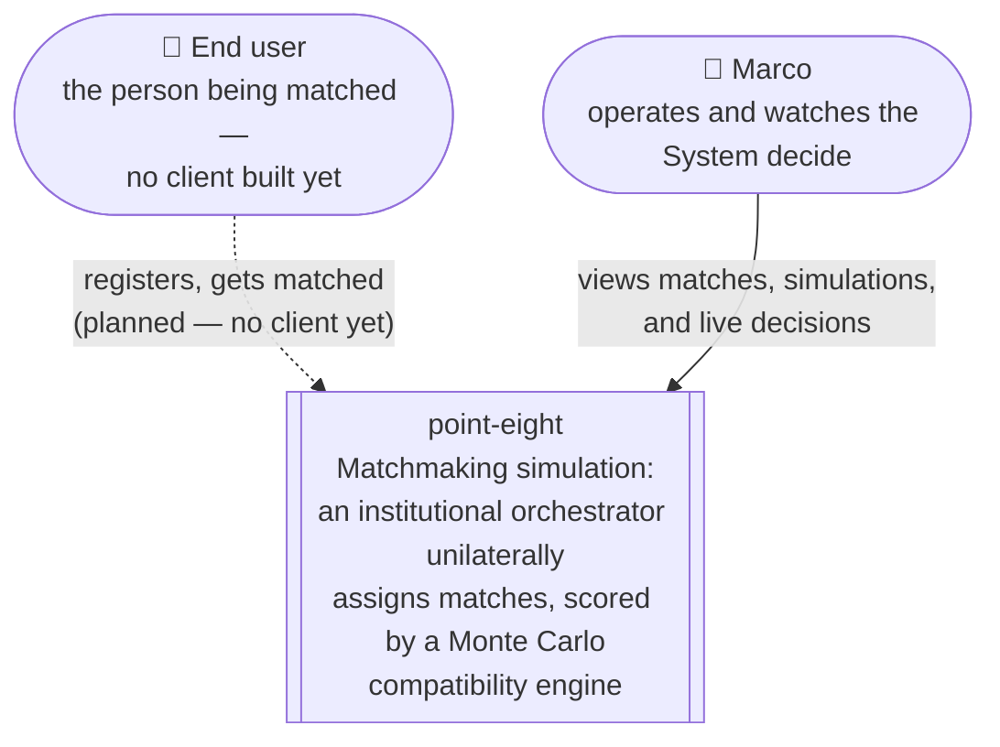
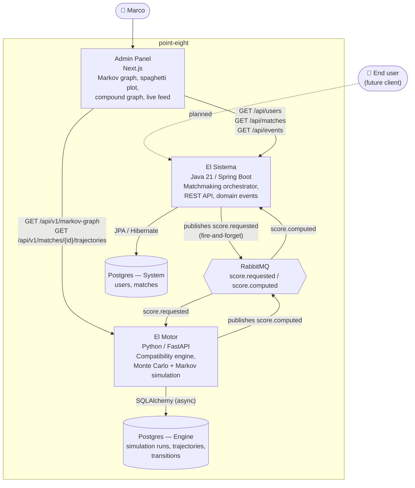

# C4 diagrams — Context and Container

M6 (optional per the spec). Rendered as Mermaid flowcharts rather than the `C4Context`/
`C4Container` diagram types Mermaid also supports: those aren't reliably rendered by GitHub's
bundled Mermaid version, while plain `flowchart` has been supported forever — the priority here is
a diagram that actually shows up when you open this file, not textbook-perfect C4 notation.

Both diagrams reflect what's actually running today, not the eventual vision: there's no end-user
client yet (the mobile client is planned for after M6, per the project roadmap), so the only real
consumer of the System right now is Marco, through the admin panel and the API directly.

## Level 1 — System Context

Who point-eight talks to, with the whole thing as one box.

## Level 2 — Containers

The deployable units and how they actually talk to each other — see `docker-compose.yml` for the
exact ports each one publishes.

### Reading the async edge

`El Sistema → RabbitMQ → El Motor → RabbitMQ → El Sistema` is one logical request (`DEC-016`), not
two independent flows: Java publishes a score request and returns `202 Accepted` immediately: the
actual score lands later, consumed off a separate response queue — there's no synchronous
request/response pair between the two services anymore.
